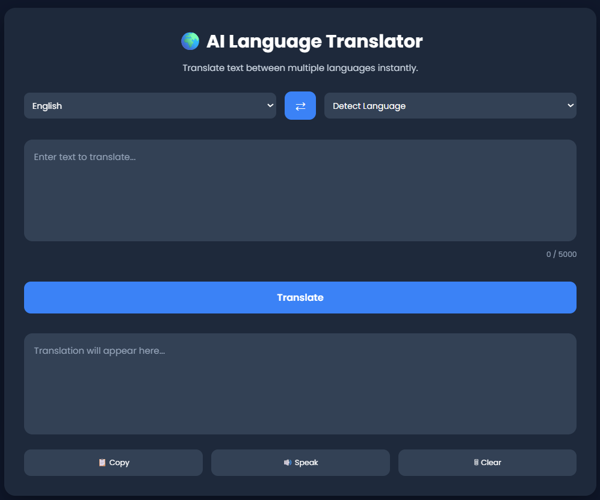
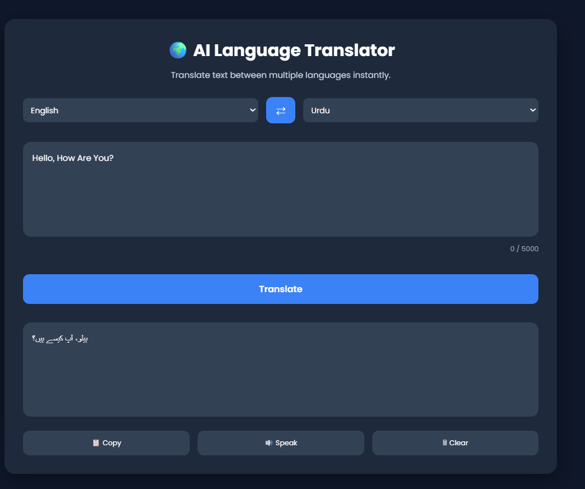

# 🌍 AI Language Translator

A modern multilingual language translator built using Flask, JavaScript, and SQLite.

The application allows users to translate text between multiple languages, automatically detect the input language, save translation history, restore previous translations, copy translated text, listen using text-to-speech, and manage translation history through a clean and intuitive interface.

## ✨ Features

- 🌍 Translate text between multiple languages
- 🤖 Automatic language detection
- 🔄 Swap source and target languages
- 📋 Copy translated text
- 🔊 Text-to-Speech support
- 🕒 Translation history
- ♻️ Restore previous translations
- 🗑️ Delete individual history items
- 🧹 Clear all translation history
- ⚡ Loading state while translating
- ⌨️ Ctrl + Enter keyboard shortcut
- 🔢 Live character counter
- 💾 SQLite database for persistent history
- 🎨 Clean and responsive user interface
- 🔔 Toast notifications

## 🚀 Tech Stack

### Backend
- Python
- Flask
- SQLite
- Deep Translator
- Langdetect
- REST APIs

### Frontend
- HTML5
- CSS3
- JavaScript

### Development Tools
- Git
- GitHub
- PyCharm

## 📂 Project Structure

```text
TranslatorApp/
│
├── database/
│   ├── database.py
│   └── translations.db
│
├── services/
│   ├── translator.py
│   ├── language.py
│   └── speech.py
│
├── static/
│   ├── css/
│   │   └── style.css
│   │
│   └── js/
│       ├── script.js
│       ├── languages.js
│       └── toast.js
│
├── templates/
│   └── index.html
│
├── app.py
├── requirements.txt
└── README.md
```

## ⚙️ Installation

### 1. Clone the repository

```bash
git clone https://github.com/your-username/TranslatorApp.git
```

### 2. Navigate to the project folder

```bash
cd TranslatorApp
```

### 3. Create a virtual environment

```bash
python -m venv .venv
```

### 4. Activate the virtual environment

**Windows**

```bash
.venv\Scripts\activate
```

**macOS / Linux**

```bash
source .venv/bin/activate
```

### 5. Install dependencies

```bash
pip install -r requirements.txt
```

### 6. Run the application

```bash
python app.py
```

### 7. Open your browser

```
http://127.0.0.1:5000
```

## 📸 Screenshots

### Home Page



### Translation Example



### Translation History


## 🔮 Future Improvements

- 🤗 Integrate Hugging Face translation models
- ⭐ Save favorite translations
- 🔍 Search translation history
- 📤 Export translation history as PDF or CSV
- 🌙 Light/Dark mode toggle
- 📱 Improve mobile responsiveness
- 🌐 Deploy the application online

## 👩‍💻 Author

**Hiba Ismail**

- 🎓 Bachelor of Computer Science
- 🤖 Aspiring AI / Machine Learning Engineer
- 📍 Karachi, Pakistan

